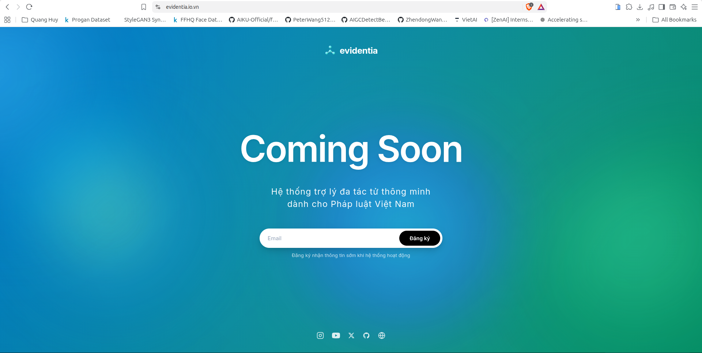

# Evidentia

**Hệ thống trợ lý đa tác tử thông minh chuyên sâu Pháp luật Việt Nam**  
**Legal Agentic-GraphRAG System for Vietnamese Law**

  <picture>
    <source media="(prefers-color-scheme: dark)" srcset="assets/logo-white.svg">
    <source media="(prefers-color-scheme: light)" srcset="assets/logo-black.svg">
    
  </picture>

[Tiếng Việt](#tiếng-việt) | [English](#english)

---

## Tiếng Việt

### 1. Giới thiệu tổng quan

Evidentia là hệ thống trợ lý thông minh ứng dụng kiến trúc đa tác tử (Multi-Agent System) kết hợp cùng Đồ thị tri thức Pháp lý và kỹ thuật GraphRAG (Legal Agentic-GraphRAG), được thiết kế chuyên biệt cho hệ thống văn bản quy phạm pháp luật Việt Nam.

Trong lĩnh vực pháp lý, các mô hình ngôn ngữ lớn (LLM) thông thường thường gặp phải nhiều hạn chế nghiêm trọng:
- Nguy cơ ảo giác (hallucination) dẫn đến các viện dẫn sai lệch hoặc không có thật.
- Khó nắm bắt hệ thống văn bản đồ sộ với các mối quan hệ đa tầng (văn bản sửa đổi, bổ sung, bãi bỏ, hướng dẫn thi hành).
- Thiếu khả năng đối chiếu và trích dẫn chuẩn xác đến từng điều khoản cụ thể.

Evidentia giải quyết các thách thức trên bằng cách tích hợp đồ thị quan hệ văn bản pháp lý với quy trình suy luận đa tác tử, đảm bảo mọi phản hồi đều có căn cứ pháp lý rõ ràng, cập nhật và có thể kiểm chứng.

### 2. Các tính năng cốt lõi dự kiến

Evidentia được xây dựng nhằm cung cấp một giải pháp toàn diện phục vụ việc nghiên cứu, tra cứu và hỗ trợ tư vấn pháp luật:

- Quy trình làm việc đa tác tử (Multi-Agent Workflow):
  - Tác tử phân tích yêu cầu (Query Analysis Agent): Phân rã câu hỏi phức tạp thành các chủ đề pháp lý độc lập.
  - Tác tử truy xuất pháp luật (Legal Retrieval Agent): Khai thác dữ liệu từ cơ sở tri thức pháp lý thông qua cơ chế tìm kiếm lai (Hybrid Search).
  - Tác tử tổng hợp và thẩm định (Synthesis & Verification Agent): Rà soát tính còn hiệu lực của văn bản và xây dựng câu trả lời kèm căn cứ điều luật chính xác.

- Đồ thị tri thức Pháp luật (Legal Knowledge Graph & GraphRAG):
  - Mô hình hóa phân cấp pháp lý từ Hiến pháp, Bộ luật, Luật đến Nghị định, Thông tư.
  - Quản lý các mối quan hệ liên văn bản như sửa đổi, bổ sung, hướng dẫn, dẫn chiếu và thay thế.

- Truy xuất thông tin lai (Hybrid Retrieval Engine):
  - Kết hợp tìm kiếm ngữ nghĩa (Semantic Embedding), tìm kiếm từ khóa chính xác (BM25) và duyệt đồ thị (Graph Traversal) nhằm tối ưu độ chính xác và độ phủ thông tin.

- Trích dẫn minh bạch và chống ảo giác:
  - Mọi câu trả lời đều được định danh cụ thể: Điều, Khoản, Điểm cùng số hiệu văn bản pháp quy liên quan.

- Khám phá văn bản pháp lý thông minh:
  - Cung cấp giao diện tra cứu trực quan, hỗ trợ xem trước nội dung điều khoản và theo dõi trạng thái hiệu lực theo thời gian thực.

- Hỗ trợ hỏi đáp và tư vấn tự động:
  - Hỗ trợ công dân, doanh nghiệp và các chuyên viên pháp lý giải đáp thắc mắc về quy định, thủ tục hành chính và tuân thủ quy phạm.

### 3. Đăng ký nhận thông tin sớm

Cổng thông tin đăng ký trải nghiệm sớm của Evidentia hiện đã được mở tại:

[https://evidentia.io.vn](https://evidentia.io.vn)

Quý người dùng có thể gửi địa chỉ email để trở thành một trong những người đầu tiên nhận thông báo khi hệ thống bắt đầu thử nghiệm thực tế.

  

---

## English

### 1. Overview

Evidentia is an intelligent legal assistant leveraging a Multi-Agent architecture combined with a Legal Knowledge Graph and GraphRAG (Legal Agentic-GraphRAG), specifically tailored for the Vietnamese legal system.

In legal applications, standard Large Language Models (LLMs) often exhibit critical shortcomings:
- Susceptibility to hallucinations, producing fabricated legal citations or incorrect advice.
- Difficulty navigating interconnected normative documents with multi-level dependencies (amendments, replacements, guiding decrees, circulars).
- Inability to verify and cite exact articles and clauses reliably.

Evidentia addresses these issues by grounding language models with a structured legal knowledge graph and a coordinated multi-agent reasoning pipeline, ensuring transparent, reliable, and auditable responses.

### 2. Planned Capabilities

Evidentia is engineered to provide a robust solution for legal research, compliance checks, and automated assistance:

- Multi-Agent Orchestration Workflow:
  - Query Analysis Agent: Decomposes intricate legal queries into modular legal sub-topics.
  - Legal Retrieval Agent: Dispatches targeted queries across hybrid search indexes to identify relevant provisions.
  - Synthesis & Verification Agent: Validates document validity status, cross-checks conditions, and formulates grounded responses.

- Legal Knowledge Graph & GraphRAG:
  - Formal ontological representation of Vietnamese normative hierarchies (Constitution, Codes, Laws, Decrees, Circulars).
  - Explicit tracking of inter-document relations including amends, guides, supersedes, and cites.

- Hybrid Retrieval Engine:
  - Integration of dense semantic embeddings, sparse lexical retrieval (BM25), and structural graph traversal for high recall and precision.

- Grounded Citations & Anti-Hallucination Guardrails:
  - Output contains verifiable citations referencing specific Articles, Clauses, and Points alongside official document reference IDs.

- Intelligent Legal Document Exploration:
  - Interactive interface for searching, previewing, and tracking the validity status of normative acts in real time.

- Automated Legal Inquiry & Compliance Guidance:
  - Assists citizens, enterprises, and legal practitioners with administrative procedures and statutory inquiries.

### 3. Early Access & Pre-registration

The pre-registration portal for Evidentia is available at:

[https://evidentia.io.vn](https://evidentia.io.vn)

Interested users can register their email address to receive early invitations and launch updates once the testing phase begins.

<!-- Placeholder for screenshot captured from evidentia.io.vn -->

  

*Note: Replace `assets/early-access-preview.png` with your actual capture of the registration screen from evidentia.io.vn.*

### 4. Source Code & Development Notice

The core source code of Evidentia—including the multi-agent backend, LangGraph state workflows, and knowledge graph ingestion pipelines—is maintained in a private repository.

This public repository serves as the project overview, architectural summary, and official announcement channel.

---

## Liên hệ & Thông tin / Contact & Inquiries

- Official Portal: [https://evidentia.io.vn](https://evidentia.io.vn)
- Development Unit: NLP & KD Lab
- Maintainer: Victor Nguyen ([VictorNguyenLPN](https://github.com/VictorNguyenLPN))
