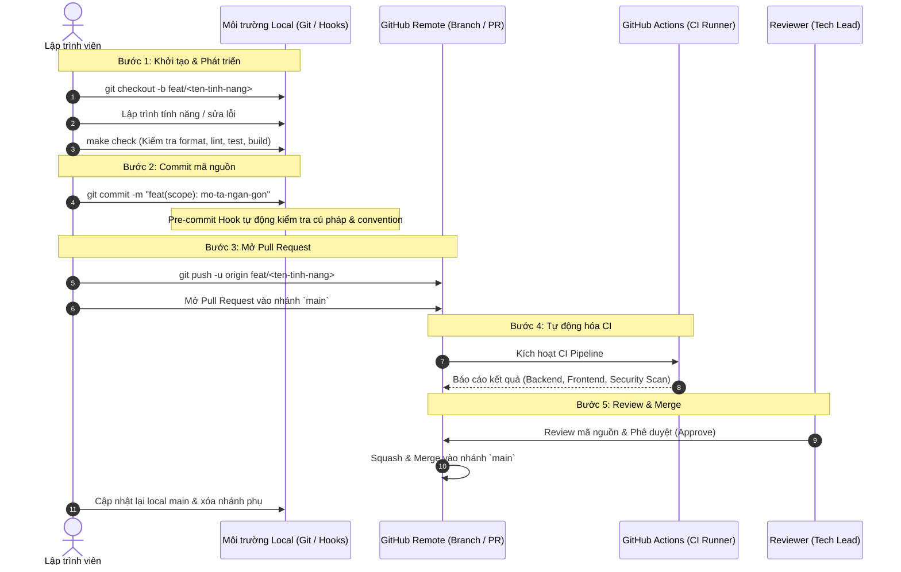

# Quy trình Phát triển Mã nguồn & Đóng góp qua GitHub (Git & PR Workflow)

Tài liệu này mô tả chi tiết quy trình chuẩn từ lúc lập trình viên nhận task, viết code trên máy cá nhân (local), kiểm tra chất lượng tự động, commit tuân thủ quy chuẩn, cho đến khi mở Pull Request (PR) và hoàn tất merge vào nhánh `main` trên GitHub.

---

## 1. Sơ đồ Tổng quan Quy trình (End-to-End Workflow)



---

## 2. Chi tiết 5 Giai đoạn Thực hiện

### Giai đoạn 1: Chuẩn bị Môi trường & Tạo Nhánh (Branching)

#### 1. Cài đặt môi trường & Git Hook (Chỉ làm 1 lần đầu tiên)
Trước khi bắt đầu code, hãy kích hoạt môi trường ảo và cài đặt git hook:
```bash
# Cài đặt toàn bộ thư viện (backend, frontend, admin, QA tools)
make install

# Kích hoạt git pre-commit hook
make pre-commit-install
```

#### 2. Cập nhật nhánh `main` mới nhất
Luôn đảm bảo bạn bắt đầu từ code mới nhất của dự án:
```bash
git checkout main
git pull origin main
```

#### 3. Tạo nhánh mới theo quy tắc
Tên nhánh phải ngắn gọn, phản ánh đúng mục đích thay đổi:
* **Tính năng mới**: `feat/<ten-tinh-nang>` (VD: `feat/temporal-filter`, `feat/auth-google`)
* **Sửa lỗi**: `fix/<ten-loi>` (VD: `fix/qdrant-sync-error`, `fix/chat-scroll`)
* **Tái cấu trúc**: `refactor/<ten-module>` (VD: `refactor/retriever-pipeline`)
* **Tài liệu**: `docs/<ten-tai-lieu>` (VD: `docs/api-guide`)

```bash
git checkout -b feat/temporal-legal-retriever
```

---

### Giai đoạn 2: Lập trình & Kiểm tra Local (Shift-Left QA)

Trong quá trình dev, bạn có thể chạy các lệnh hỗ trợ từ `Makefile`:

1. **Chạy các service để test tính năng:**
   ```bash
   make dev-backend    # Khởi chạy FastAPI Backend (port 8000)
   make dev-frontend   # Khởi chạy React Frontend (port 5173)
   make dev-admin      # Khởi chạy Admin Dashboard (port 5174)
   ```

2. **Format code tự động:**
   ```bash
   make format
   ```
   *Lệnh này dùng Ruff tự động căn chỉnh code, sắp xếp import và sửa các lỗi style cơ bản.*

3. **Chạy toàn bộ kiểm tra chất lượng trước khi commit:**
   ```bash
   make check
   ```
   > [!IMPORTANT]
   > Lệnh `make check` sẽ chạy liên hoàn:
   > 1. Kiểm tra format Python (Ruff).
   > 2. Kiểm tra Linting (Ruff cho Python, ESLint cho TypeScript).
   > 3. Chạy toàn bộ Unit Tests (Pytest + Coverage).
   > 4. Biên dịch thử bản Production (Vite Build cho Frontend & Admin Dashboard).
   >
   > Chỉ khi màn hình hiện `All checks passed! Ready to push code.` thì code của bạn mới đạt chuẩn.

---

### Giai đoạn 3: Commit & Push Mã Nguồn

#### 1. Kiểm tra trạng thái file
```bash
git status
```

#### 2. Đưa file vào staging
```bash
git add .
# Hoặc add từng file cụ thể:
# git add backend/rag/hybrid_retriever.py tests/test_retriever.py
```

#### 3. Viết commit message theo quy chuẩn `CONVENTION.md`
Cấu trúc commit bắt buộc:
```text
<type>[scope]: <action> <description>
```
* **`type`**: `feat` | `fix` | `docs` | `refactor` | `style` | `test` | `chore`
* **`scope`** *(tùy chọn)*: `(api)`, `(rag)`, `(ui)`, `(auth)`, `(admin)`, `(db)`
* **`description`**: Bắt đầu bằng chữ thường, động từ nguyên thể tiếng Anh (`add`, `update`, `fix`, `resolve`).

**Ví dụ hợp lệ:**
```bash
git commit -m "feat(rag): add temporal filter for legal article search"
git commit -m "fix(auth): resolve expired jwt token decoding error"
git commit -m "docs: update development and contribution guide"
```

> [!NOTE]
> Khi bạn gõ `git commit`, **Pre-commit Hook** sẽ tự động chặn nếu:
> - Còn khoảng trắng thừa cuối dòng.
> - Code Python chưa format đúng chuẩn Ruff.
> - Commit message sai quy tắc `CONVENTION.md`.

#### 4. Đẩy nhánh lên GitHub Remote
```bash
git push -u origin feat/temporal-legal-retriever
```

---

### Giai đoạn 4: Mở Pull Request (PR) & Chờ CI Kiểm Tra

#### 1. Mở Pull Request trên giao diện GitHub
1. Truy cập vào Repository trên GitHub.
2. Bạn sẽ thấy thông báo màu vàng gợi ý: **"feat/... had recent pushes"** -> Click nút **Compare & pull request**.
3. Chọn nhánh đích: `base: main` $\leftarrow$ `compare: feat/temporal-legal-retriever`.

#### 2. Điền thông tin mô tả PR
Sử dụng cấu trúc mô tả rõ ràng để người review nắm được ngữ cảnh:

```markdown
## 📌 Mục đích thay đổi
- Thêm tính năng lọc điều khoản luật theo mốc thời gian hiệu lực.
- Bổ sung unit tests cho hybrid retriever.

## 🛠️ Các thay đổi chính
- `backend/rag/hybrid_retriever.py`: Cập nhật logic query Qdrant với payload filter `valid_from` và `valid_to`.
- `tests/test_retriever.py`: Bổ sung 3 test cases cho truy xuất theo thời gian.

## 🧪 Kết quả kiểm thử
- Đã chạy `make check` đạt 100% pass trên máy local.
- Thử nghiệm tìm kiếm văn bản năm 2015 cho kết quả chính xác không bị lẫn luật sửa đổi 2020.
```

#### 3. Quan sát kết quả GitHub Actions CI
Ngay khi mở PR, hệ thống GitHub Actions sẽ tự động chạy 4 jobs độc lập:
* 🟢 **Backend Lint & Test**: Chạy Ruff và Pytest.
* 🟢 **Frontend Lint & Build**: Chạy ESLint và build React Frontend.
* 🟢 **Admin Dashboard Build**: Type-check và build Admin Dashboard.
* 🟢 **Secret Leak Detection**: Quét chống lọt lộ API Key / Secrets.

> [!WARNING]
> Nếu có bất kỳ job nào báo 🔴 **Failed**:
> 1. Click vào job bị lỗi để xem chi tiết log.
> 2. Sửa lỗi ngay trên máy local.
> 3. Chạy lại `make check` để chắc chắn đã fix.
> 4. Commit và `git push` lại vào cùng nhánh đó. GitHub PR sẽ tự động chạy lại CI.

---

### Giai đoạn 5: Code Review & Hoàn tất Merge

1. **Review:** Người phụ trách (Reviewer/Lead) sẽ xem qua diff code, để lại comment góp ý nếu cần chỉnh sửa.
2. **Khi được Approve (Phê duyệt):**
   - Sử dụng phương thức **Squash and merge** trên GitHub để gộp các commit vụn vặt thành 1 commit duy nhất trên nhánh `main`.
3. **Dọn dẹp local sau khi merge:**
   ```bash
   # Quay về nhánh main và kéo code mới nhất đã merge
   git checkout main
   git pull origin main

   # Xóa nhánh feature cũ trên máy local
   git branch -d feat/temporal-legal-retriever
   ```

---

## 3. Bảng Tra cứu Nhanh các Lệnh thường dùng (Cheat Sheet)

| Tác vụ | Lệnh thực hiện |
| :--- | :--- |
| **Bắt đầu ngày mới** | `git checkout main && git pull origin main` |
| **Tạo nhánh mới** | `git checkout -b <type>/<ten-nhanh>` |
| **Format code** | `make format` |
| **Kiểm tra trước khi commit** | `make check` |
| **Commit chuẩn** | `git commit -m "<type>(<scope>): <action> <message>"` |
| **Push nhánh lần đầu** | `git push -u origin <ten-nhanh>` |
| **Cập nhật commit mới lên PR** | `git push` |
| **Hủy bỏ thay đổi chưa commit** | `git restore .` |
| **Xóa nhánh đã merge xong** | `git branch -d <ten-nhanh>` |

---

## 4. Các câu hỏi thường gặp (Troubleshooting)

#### Q1: Pre-commit hook báo lỗi commit message không hợp lệ?
- **Nguyên nhân:** Message không bắt đầu bằng các type được phép (`feat`, `fix`, `docs`, `refactor`, `style`, `test`, `chore`) hoặc sau dấu `:` không có dấu cách.
- **Cách sửa:** Chỉnh sửa lại commit message theo mẫu:
  ```bash
  git commit --amend -m "feat(api): add new status endpoint"
  ```

#### Q2: `make check` báo lỗi ESLint ở Frontend?
- Chạy `cd frontend && npm run lint` để xem chính xác dòng code và tên file bị lỗi (ví dụ: biến import thừa không dùng). Sửa lỗi rồi chạy lại `make check`.

#### Q3: Cần cập nhật code mới nhất từ `main` vào nhánh feature đang làm dở?
```bash
git checkout main
git pull origin main
git checkout feat/<nhanh-cua-ban>
git merge main
# Xử lý conflict nếu có, sau đó chạy `make check` và push lại.
```
